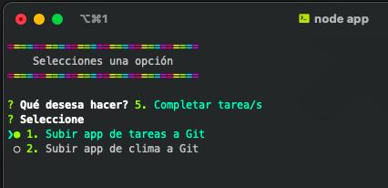
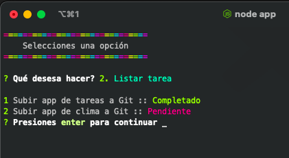

# NodeJS

### App de tareas con menú interactivo

**Librerías:**

+ [inquirer](https://www.npmjs.com/package/inquirer)
+ [colors](https://www.npmjs.com/package/colors)
+ [uuid](https://www.npmjs.com/package/uuidv4)

**Ejemplo:**

--- 

[Curso: Fernando Herrera](https://www.udemy.com/user/550c38655ec11/)

----