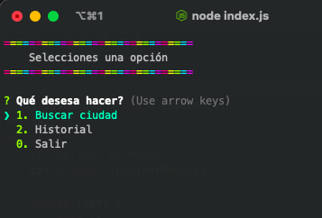
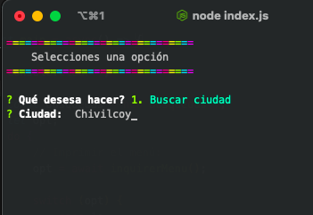
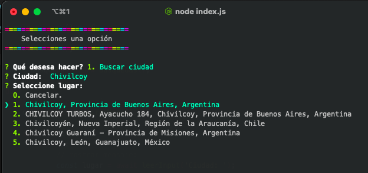
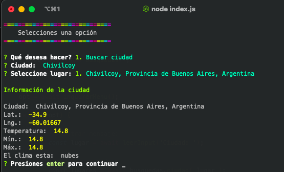
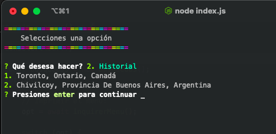

# NodeJS

### App de clima con menú interactivo
Permite consultar el clima de alguna localidady mantiene un historial (.json) en de las últimas 5 búsquedas.

**Librerías:**

+ [inquirer](https://www.npmjs.com/package/inquirer)  
+ [colors](https://www.npmjs.com/package/colors)  
+ [axios](https://www.npmjs.com/package/axios)  
+ [dotenv](https://www.npmjs.com/package/dotenv)  

**APIs**  

+ Obtener información de la ciudad de consultar: 
	+ [mapbox](https://www.mapbox.com/)

+ Obtener datos del clima para la ciudad seleccionada:  
	+ [openweathermap](https://openweathermap.org/)

**Ejemplo:**

--- 

[Curso: Fernando Herrera](https://www.udemy.com/user/550c38655ec11/)

----